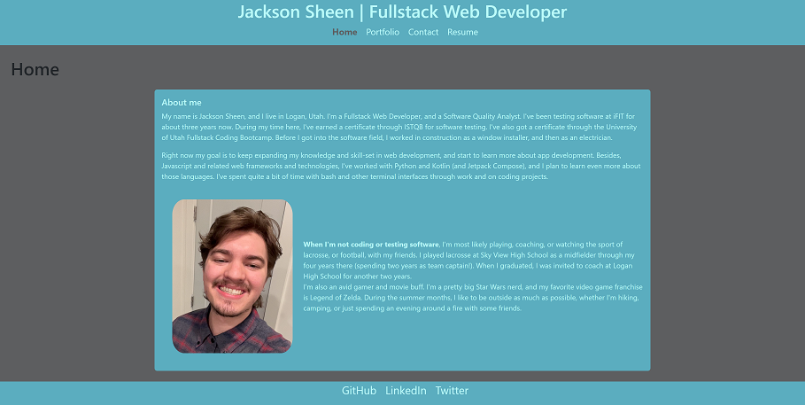
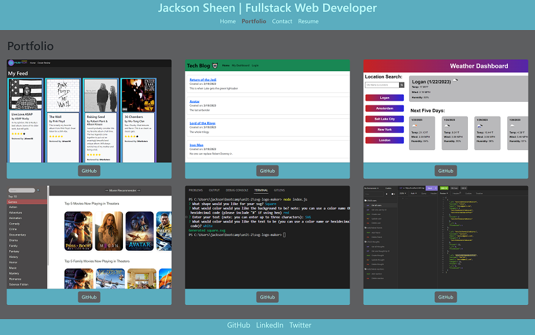
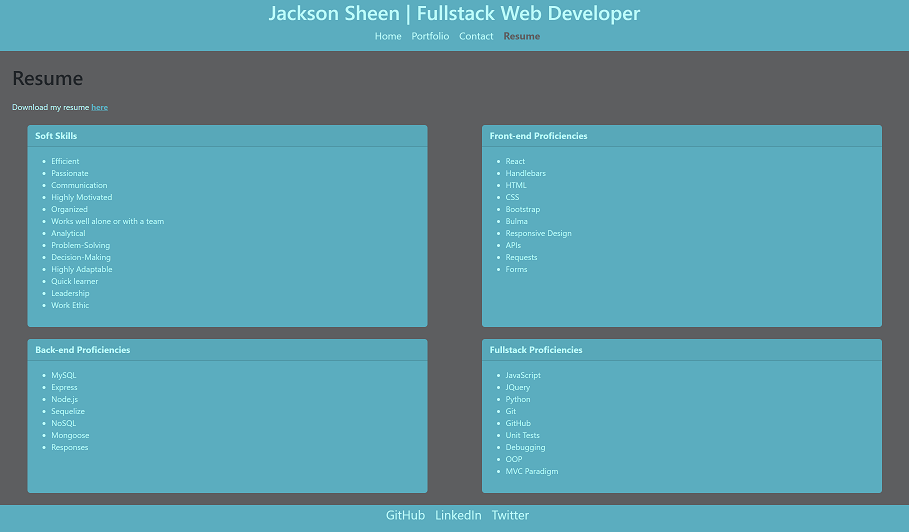

# React Portfolio

## ✏️ Description:

With this project, I wanted to build a new portfolio with a professional clean look, while displaying the information associated with me and my career as a web developer so far. React is the front-end JavaScript library I used for this project. While building this project, I gained a better understanding of React, as well as solidified my understanding of frontend development, all while creating a portfolio to be proud of.

## 📜 License:

This project is licensed under the MIT License. See LICENSE in the repo for more information.

## User Story

* AS A fullstack web developer that wants to showcase my work
* I WANT a portfolio website built and deployed with React
* SO THAT I can share information about me and my projects, and forms of contact

## Acceptance Criteria

* GIVEN a single-page application portfolio for a web developer
* WHEN I load the portfolio
* THEN I am presented with a page containing a header, a section for content, and a footer
* WHEN I view the header
* THEN I am presented with the developer's name and navigation with titles corresponding to different sections of the portfolio
* WHEN I view the navigation titles
* THEN I am presented with the titles About Me, Portfolio, Contact, and Resume, and the title corresponding to the current section is highlighted
* WHEN I click on a navigation title
* THEN I am presented with the corresponding section below the navigation without the page reloading and that title is highlighted
* WHEN I load the portfolio the first time
* THEN the About Me title and section are selected by default
* WHEN I am presented with the About Me section
* THEN I see a recent photo or avatar of the developer and a short bio about them
* WHEN I am presented with the Portfolio section
* THEN I see titled images of six of the developer’s applications with links to both the deployed applications and the corresponding GitHub repositories
* WHEN I am presented with the Contact section
* THEN I see a contact form with fields for a name, an email address, and a message
* WHEN I move my cursor out of one of the form fields without entering text
* THEN I receive a notification that this field is required
* WHEN I enter text into the email address field
* THEN I receive a notification if I have entered an invalid email address
* WHEN I am presented with the Resume section
* THEN I see a link to a downloadable resume and a list of the developer’s proficiencies
* WHEN I view the footer
* THEN I am presented with text or icon links to the developer’s GitHub and LinkedIn profiles, and their profile on a third platform (Stack Overflow, Twitter)

## 🖥️ Technologies Used

* JavaScript
* React
* Bootstrap
* HMTL/CSS

## ⚙️ Installation

N/A

## 🌐 Deployed Application:

https://jsheen98.github.io/react-portfolio/

## 📸 Assets: 

The following pictures represent the website's functionality:

## 📖 Code Resources:

* Referenced class repository for component creation, file structure, react setup, etc.
* React Documentation
* Bootstrap Documentation
* Color palette (randomly generated): https://coolors.co/36413e-5d5e60-8d8d92-5badbf-b9faf8
* Created the responsive navbar with the help of this video: https://dev.to/ziratsu/code-a-responsive-navbar-with-react-45le
* Created hover overlays for projects in my portfolio with the help of: https://www.w3schools.com/howto/tryit.asp?filename=tryhow_css_image_overlay_fade
* Figured out how to add a downloadable link at this stack overflow post https://stackoverflow.com/questions/50694881/how-to-download-file-in-react-js